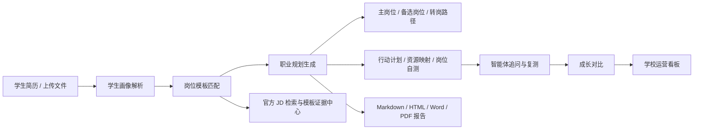
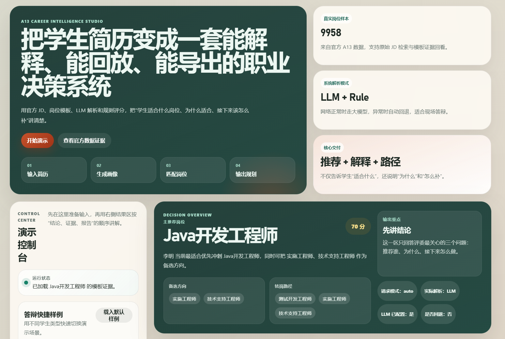
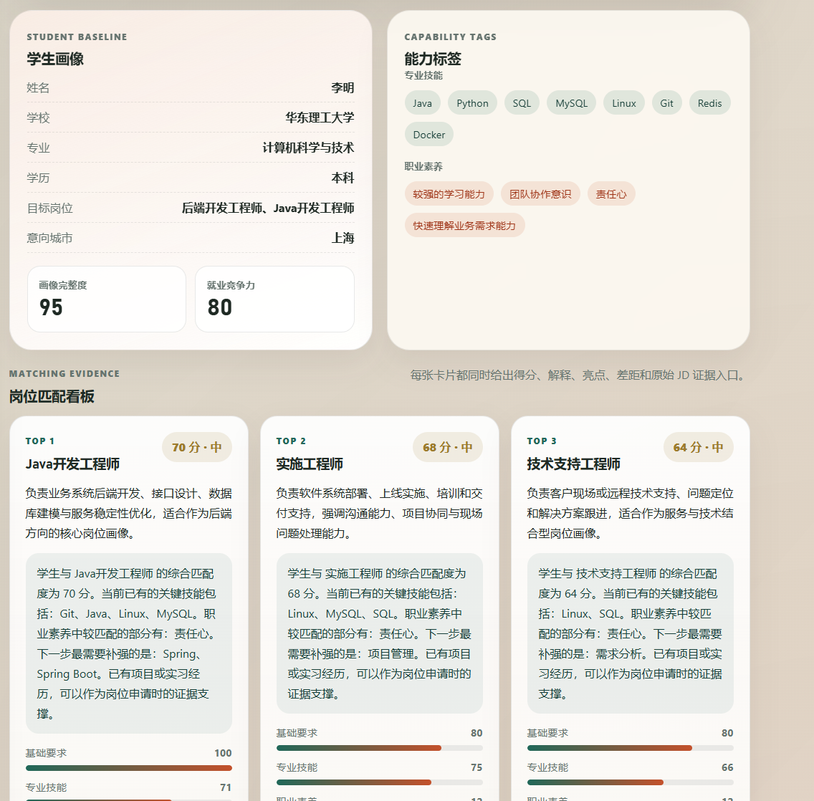
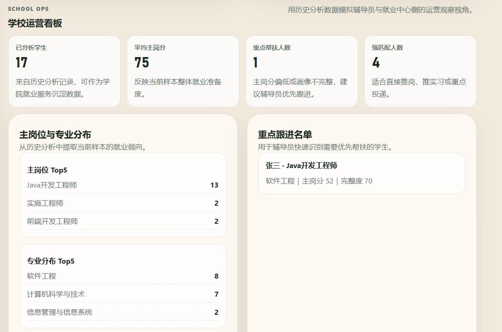

# CareerLoop-A13

基于官方 JD 数据、证据驱动生成与可解释匹配的大学生职业规划智能体项目。

本仓库对应 2026 年中国大学生服务外包创新创业大赛 A13 赛题：`基于 AI 的大学生职业规划智能体`。  
项目目标不是做一个简单的聊天机器人，而是构建一套面向高校就业场景的完整系统，帮助学生和学校完成：

- 简历解析与学生画像生成
- 基于官方 JD 的岗位画像与岗位模板匹配
- 主推荐岗位、备选岗位与转岗路径规划
- 职业规划报告生成与导出
- 智能体追问、岗位自测、资源映射与复测闭环
- 历史分析留存与学校运营视角数据汇总

## 项目亮点

- `官方数据驱动`
  使用 A13 官方提供的 JD 样本数据构建岗位模板库，支持原始 JD 检索和模板证据回看。

- `证据驱动生成`
  先检索岗位模板与官方 JD 证据，再输出建议与规划，避免脱离依据的黑箱推荐。

- `RAG 式证据链`
  将岗位模板摘要与官方 JD 自动分块、检索、重排，并把高相关证据片段直接带入结果页与报告。

- `可解释推荐`
  不只给岗位分数，还展示共享技能、关键差距、行动建议和推荐原因。

- `多阶段工作流`
  把解析、匹配、规划、追问、自测、复测与学校看板编排成一条可校验、可降级的任务链。

- `成长闭环`
  支持智能体补充问答、岗位自测、资源映射、二次分析和成长对比。

- `多角色视角`
  除学生端外，还支持辅导员端和就业中心端的运营观察视图。

- `人机协同治理`
  通过样例验证中心、模板证据回看和学校运营看板，把系统从“能推荐”提升为“可抽检、可复盘、可运营”。

- `完整交付`
  支持历史记录、Markdown/HTML/Word/PDF 导出，适合演示、评审和归档。

## 系统结构图



## 运行截图

### 首页总览



### 证据中心与模板回看



### 学校运营看板



## 仓库结构

```text
.
├─ A13_官方资料/              # 官方赛题资料与 JD 数据
├─ a13_starter/              # 项目主体
│  ├─ src/                   # 后端核心逻辑
│  ├─ web/                   # 前端页面
│  ├─ generated/             # 生成数据与缓存
│  ├─ samples/               # 演示样例简历
│  ├─ tools/                 # 数据处理脚本
│  ├─ README.md              # 详细运行说明
│  └─ DEPLOY.md              # 部署说明
├─ docs/
│  └─ screenshots/           # README 截图占位与后续真实截图
├─ LICENSE
└─ README.md
```

## 快速启动

在仓库根目录执行：

```bash
pip install -r a13_starter/requirements.txt
python -m a13_starter.api_server
```

如果你的环境里 `python` 不可用，可以改用：

```bash
python3 -m a13_starter.api_server
```

启动后打开浏览器：

```text
http://127.0.0.1:8000/
```

如果你需要启用大模型解析，可以配置 DashScope：

### Windows PowerShell

```powershell
$env:DASHSCOPE_API_KEY="你的key"
$env:LLM_PROVIDER="dashscope"
$env:DASHSCOPE_MODEL="qwen3.5-flash"
$env:A13_API_PORT="8001"
py -m a13_starter.api_server
```

### macOS / Linux / Git Bash

```bash
export DASHSCOPE_API_KEY="你的key"
export LLM_PROVIDER="dashscope"
export DASHSCOPE_MODEL="qwen3.5-flash"
export A13_API_PORT="8001"
python3 -m a13_starter.api_server
```

## 推荐演示流程

推荐先使用内置样例完成演示：

- `a13_starter/samples/demo_resume_backend.txt`
- `a13_starter/samples/demo_resume_implementation.txt`
- `a13_starter/samples/demo_resume_frontend.txt`

页面中可以直接演示：

1. 简历导入或粘贴
2. 学生画像与岗位匹配
3. 职业路径与行动计划
4. 模板证据与官方 JD 检索
5. 智能体追问与岗位自测
6. 资源映射与成长对比
7. 学校运营看板与历史记录
8. 报告导出

## 详细说明

更详细的本地运行、导出、解析模式和部署说明，请看：

- [a13_starter/README.md](/mnt/d/Code/server2026/a13_starter/README.md)
- [a13_starter/DEPLOY.md](/mnt/d/Code/server2026/a13_starter/DEPLOY.md)

## License

本项目使用 [MIT License](LICENSE)。
