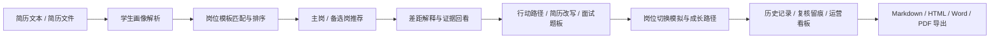

# CareerLoop-A13

`CareerLoop-A13` 是面向第十七届中国大学生服务外包创新创业大赛 A13 赛题“基于 AI 的大学生职业规划智能体”开发的完整项目仓库。

项目目标不是做一个简单的问答机器人，而是围绕大学生求职场景，构建一套可运行、可解释、可演示、可交付的职业规划系统。系统以官方 JD 数据为基础，将学生简历、岗位证据、推荐排序、行动方案、报告导出和运营复核串成一条完整服务链路。

## 项目概述

系统当前已经支持以下核心流程：

- 输入或上传简历，自动解析学生画像
- 基于官方 JD 数据构建岗位模板库并完成岗位匹配
- 输出主推荐岗位、备选岗位、岗位差异解释和切换模拟
- 生成行动路径、简历改写建议、面试题板和成长资源
- 展示岗位证据视图、原始样本切片和模板基线
- 保存历史记录，支持复核留痕和运营看板
- 导出 Markdown、HTML、Word、PDF 报告

## 项目亮点

- `官方数据驱动`
  直接基于赛题提供的 `A13-JD采样数据.xls` 构建岗位库，而不是只靠人工写死规则。

- `证据驱动推荐`
  推荐结果不仅有分数，还会展示共享技能、关键差距、代表样本和排序解释。

- `真实求职闭环`
  不只告诉学生“适合什么岗”，还会继续给出行动计划、项目补强、简历优化和面试准备。

- `多岗位对照能力`
  支持主岗与备选岗对照、能力雷达图、岗位切换模拟和差异化策略联动。

- `可落地交付`
  系统包含本地 Web 端、历史记录、复核入口、报告导出和部署文档，适合答辩和提交。

## 数据基础

本仓库内已包含赛题官方资料：

- `A13_官方资料/第十七届中国大学生服务外包创新创业大赛A13赛题.pdf`
- `A13_官方资料/A13-JD采样数据.xls`

当前项目已经基于官方 JD 数据完成清洗、归一化和模板沉淀，现有生成结果包括：

- `4884` 条清洗后的岗位记录
- `17` 个核心岗位模板
- 内置 `7` 份典型学生样例用于答辩演示与基准验证

当前重点覆盖的岗位方向包括：

- Java开发工程师
- C/C++开发工程师
- 前端开发工程师
- Python开发工程师
- 数据分析师
- 实施工程师
- 技术支持工程师
- 测试工程师
- 软件测试工程师
- 测试开发工程师
- 产品助理
- 运营专员
- 项目专员
- 项目经理

## 系统流程



## 技术栈

- 后端：Python
- 前端：原生 HTML / CSS / JavaScript
- 可视化：ECharts
- 存储：SQLite
- 模型接入：DashScope / OpenAI 兼容接口
- 文件解析：`txt`、`md`、`docx`、`pdf`
- 报告导出：Markdown、HTML、Word、PDF

## 仓库结构

```text
.
├─ A13_官方资料/                  # 赛题 PDF 与官方 JD 样本
├─ a13_starter/
│  ├─ src/                       # 核心业务逻辑
│  ├─ web/                       # 前端页面
│  ├─ generated/                 # 岗位库、模板库、历史数据库等生成结果
│  ├─ samples/                   # 内置演示样例
│  ├─ tools/                     # 数据处理、benchmark、模板生成脚本
│  ├─ README.md                  # 子项目详细运行说明
│  ├─ DEPLOY.md                  # 部署说明
│  ├─ 答辩讲解提纲.md            # 答辩讲解材料
│  ├─ 答辩演示脚本.md            # 现场演示顺序建议
│  └─ 提交版说明.md              # 提交包整理建议
├─ .env.example                  # 环境变量模板
├─ LICENSE
└─ README.md
```

## 快速开始

### 1. 安装依赖

在仓库根目录执行：

```bash
pip install -r a13_starter/requirements.txt
```

### 2. 配置环境变量

推荐复制环境模板：

```bash
cp .env.example .env.local
```

然后按需修改 `.env.local`：

```bash
DASHSCOPE_API_KEY=你的key
LLM_PROVIDER=dashscope
DASHSCOPE_MODEL=qwen-plus
A13_API_HOST=127.0.0.1
A13_API_PORT=8000
```

项目会自动读取仓库根目录下的 `.env` 和 `.env.local`。

如果暂时没有可用的模型 Key，也可以直接运行，系统会回退到规则解析模式。

### 3. 启动服务

```bash
python -m a13_starter.api_server
```

如果当前环境使用的是 `python3`：

```bash
python3 -m a13_starter.api_server
```

### 4. 打开页面

浏览器访问：

```text
http://127.0.0.1:8000/
```

## 推荐演示方式

建议优先使用内置样例完成答辩演示：

- `a13_starter/samples/demo_resume_backend.txt`
- `a13_starter/samples/demo_resume_implementation.txt`
- `a13_starter/samples/demo_resume_frontend.txt`
- `a13_starter/samples/demo_resume_data_analyst.txt`
- `a13_starter/samples/demo_resume_operations.txt`
- `a13_starter/samples/demo_resume_testdev.txt`

建议演示顺序：

1. 先用后端样例展示完整链路
2. 再切换实施或前端样例，体现推荐结果会随输入变化
3. 展示证据基线、原始 JD 检索和岗位切换模拟
4. 展示行动路径、简历作战包和导出报告
5. 最后回到历史记录与复核入口，体现交付完整性

## Benchmark 与验证

项目内置了样例基准验证能力，可用于赛前联调和答辩展示。

运行方式：

```bash
python -m a13_starter.tools.run_benchmark --parser-mode rule
```

当前已验证结果：

- 内置 `7` 份样例全部执行成功
- `Top1 命中率 = 100%`
- `Top3 命中率 = 100%`
- `严格通过率 = 100%`

如果希望测试大模型解析链路，也可以运行：

```bash
python -m a13_starter.tools.run_benchmark --parser-mode auto
```

## 常用输出

项目运行后常见输出位于：

- `a13_starter/generated/job_profiles.jsonl`
- `a13_starter/generated/role_profile_templates.json`
- `a13_starter/generated/dataset_summary.json`
- `a13_starter/generated/analysis_history.db`
- `a13_starter/generated/career_plan_report.md`

## 文档导航

如果你需要更细的说明，可继续阅读：

- [a13_starter/README.md](a13_starter/README.md)
- [a13_starter/DEPLOY.md](a13_starter/DEPLOY.md)
- [a13_starter/答辩讲解提纲.md](a13_starter/答辩讲解提纲.md)
- [a13_starter/答辩演示脚本.md](a13_starter/答辩演示脚本.md)
- [a13_starter/提交版说明.md](a13_starter/提交版说明.md)
- [A13_官方资料/README.md](A13_官方资料/README.md)
- [FINAL_DELIVERY_CHECKLIST.md](FINAL_DELIVERY_CHECKLIST.md)

## 当前状态

目前仓库中的主流程已经可以真实运行，并完成过以下联调：

- 本地服务启动与系统自检
- 简历输入与文件上传
- 岗位匹配与职业规划生成
- 历史记录保存与复核留痕
- Word / PDF 导出
- DashScope 实时模型调用

## License

本项目采用 [MIT License](LICENSE)。
